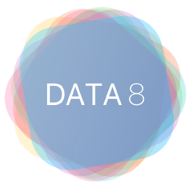

<link rel="icon" type="image/x-icon" href="/favicon.ico">

# Data 8: The Foundations of Data Science

## Course Description

The UC Berkeley Foundations of Data Science course combines three perspectives:
inferential thinking, computational thinking, and real-world relevance. Given
data arising from some real-world phenomenon, how does one analyze that data so
as to understand that phenomenon? The course teaches critical concepts and
skills in computer programming and statistical inference, in conjunction with
hands-on analysis of real-world datasets, including economic data, document
collections, geographical data, and social networks. It delves into social and legal issues surrounding data analysis, including issues of privacy and data ownership.

## Offerings

-  [Summer 2025](./su25)
-  [Spring 2025](./sp25)
-  [Fall 2024](./fa24)
-  [Summer 2024](./su24)
-  [Spring 2024](./sp24)
-  [Fall 2023](./fa23)
-  [Summer 2023](./su23)
-  [Spring 2023](./sp23)
-  [Fall 2022](./fa22)
-  [Summer 2022](./su22)
-  [Spring 2022](./sp22)
-  [Fall 2021](./fa21)
-  [Summer 2021](./su21)
-  [Spring 2021](./sp21)
-  [Fall 2020](./fa20)
-  [Summer 2020](./su20)
-  [Spring 2020](./sp20)
-  [Fall 2019](./fa19)
-  [Summer 2019](./su19)
-  [Spring 2019](./sp19)
-  [Fall 2018](./fa18)
-  [Summer 2018](./su18)
-  [Spring 2018](./sp18)
-  [Fall 2017](./fa17)
-  [Summer 2017](./su17)
-  [Spring 2017](./sp17)
-  [Fall 2016](./fa16)
-  [Spring 2016](https://data-8.appspot.com/sp16/course)
-  [Fall 2015](./fa15)

## Materials

It has been our vision since the beginning of Data 8 that these materials are publicly licensed as open educational resources. Most repositories are licensed with [MIT](https://opensource.org/license/mit), [BSD](https://opensource.org/license/bsd-3-clause), or [CC](https://opensource.creativecommons.org/) licenses which makes them free to use and adapt. However, the textbook is licensed with [CC BY-NC-ND 4.0](https://creativecommons.org/licenses/by-nc-nd/4.0/deed.en) which allows free sharing of the material, but does not allow for the distribution of derived material.

**Textbook**: [Computational and Inferential Thinking: The Foundations of Data
Science](http://inferentialthinking.com) is a free online textbook that
includes interactive Jupyter notebooks and public data sets for all examples.
The textbook source is maintained on [this GitHub](https://github.com/data-8/textbook).

**Assignments**:
All assignments for all offerings are available in the [Data 8 GitHub Organization](https://github.com/data-8), typically in `materials-semYY` repositories as Jupyter Notebooks.
The notebooks assume a Python 3 installation with the standard modules from [an Anaconda
installation](https://www.continuum.io/downloads) such as Numpy and Matplotlib,
as well as the [datascience](https://pypi.python.org/pypi/datascience/) and, depending on the year,
[okpy](https://pypi.python.org/pypi/okpy/) or [otter-grader](https://otter-grader.readthedocs.io/en/latest/) modules.

**Lecture Materials**: All lecture videos, slides and demonstration notebooks from [Fall
2016](https://www.youtube.com/playlist?list=PLFeJ2hV8Fyt7mjvwrDQ2QNYEYdtKSNA0y) to current iterations of the course are available via links on the respective course calendars.
To request access to the source of the slides for
instructional purposes, please fill out our [Data 8 Instructor
Interest](https://forms.gle/iKLcryjZXit5913k7)
form.

## Infrastructure

All of the software components of the course are maintained as open-source
projects. We encourage you to contact us if you want any help using them.
We also have prepared [a guide on how to set up course
infrastructure](http://data8.org/zero-to-data-8/).

**The [`datascience`](http://data8.org/datascience) module**: The course uses a module
for table manipulation, charts, and maps that provides an interface appropriate
for an introductory course. The `Table` class is similar to a `DataFrame` in
[Pandas](http://pandas.pydata.org/), but explicitly does not support row
indexes, hierarchical indexes, time series data, missing values, slicing, and
many other advanced features that can complicate table manipulation for novices.
The charting features use Matplotlib, but customize the output to match the
pedagogical goals of the course. The mapping features are implemented by
[Folium](https://github.com/python-visualization/folium), but aim to simplify
working with tables and geojson files. While the `datascience` module can
certainly be used outside the context of the course, it was specifically
designed to support the Data 8 curriculum, while setting up students to
transition to more standard tools such as Pandas.

**The [otter-grader](https://otter-grader.readthedocs.io/en/latest/) automatic grading software**: All notebooks are created using the otter-grader notebook creation format. This software generates two notebooks from a parent notebook. The first contains only "public" tests that are used to help students evaluate whether or not solutions to questions are correct -- a type of client-side validation for the student. The second notebook contains solutions as well as "private" tests that students are not able to see. These tests are usually used to evaluate correctness and edge cases as well as assign points.  This system is used in conjuction with [Gradescope](http://gradescope.com) at Berkeley to grade and assign points to student work but an instructor is also able grade notebooks on their own machines, see the documentation at [otter-grader](https://otter-grader.readthedocs.io/en/latest/), as well as use a free service that we deployed called [otter-service-standalone](http://grader.datahub.berkeley.edu/). 

**Hosted Computing Environment**:
We provide a hosted environment for our students to edit and execute their
Notebooks: DataHub. DataHub is a tool that utilizes cloud computing infrastructure to deploy scalable resources that enable users to interact remotely with a standardized, common computing environment.
All students have access to the exact same computing environment and resources. As of Summer 2025, the [Data 8 Specific Datahub](https://data8.datahub.berkeley.edu/) has restricted access for only students enrolled in the current or previous semester's offering of Data 8. The [general purpose DataHub](https://datahub.berkeley.edu/) is still available to all UC Berkeley students, staff, and faculty.

If you want more information about any of these materials or tools, please fill out our [Data
8
Interest](https://forms.gle/iKLcryjZXit5913k7)
form or email `ds-courses@berkeley.edu`.
